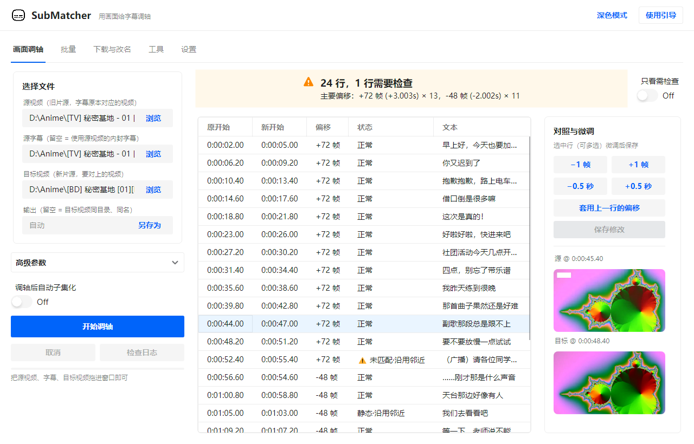
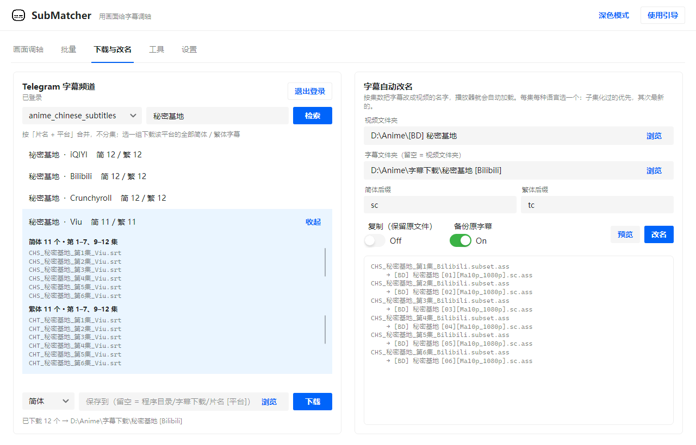

<p align="center">
  
</p>

<h1 align="center">SubMatcher</h1>

<p align="center">用画面给字幕调轴，视频版的 <a href="https://github.com/tp7/Sushi">Sushi</a>。</p>

<p align="center">
  <a href="https://github.com/zzzwannasleep/submatcher/releases/latest"></a>
  <a href="https://github.com/zzzwannasleep/submatcher/releases"></a>
  <a href="https://github.com/zzzwannasleep/submatcher/actions/workflows/release.yml"></a>
  
  
</p>

<p align="center">
  <picture>
    <source media="(prefers-color-scheme: dark)" srcset="docs/screenshot-dark.png">
    
  </picture>
</p>

TV / Web 的字幕搬到 BD 上，时间轴对不上。Sushi 靠音频对齐，SubMatcher 靠画面：把每行字幕出现时的画面拿到新片源里找，找到哪就挪到哪。台标、分辨率、调色不同都不影响，音轨重混或者干脆没有音轨也照样能用。

## 下载

去 [Releases](https://github.com/zzzwannasleep/submatcher/releases/latest) 下对应平台的 zip，解压就能用。带 `-ffmpeg` 的自带 ffmpeg，一般下这个。

macOS 第一次打开被拦的话，对解压出来的文件夹执行 `xattr -cr`。

## 用法

把源视频、源字幕、目标视频拖进窗口，点「开始调轴」。两边黑边不一样（BD 有黑边 WEB 没有，或者反过来）会自动检测并切掉再比，字幕画布也跟着挪到新画面里，不会被拉伸。字幕输出到目标视频旁边，没把握的行会标出来，可以对着画面逐行微调。重新作画或者裁切过的镜头找不到对应画面，也会标出来。

整季批量处理、手动平移、转帧率、转编码、简繁转换（[繁化姬](https://zhconvert.org)），还有字体子集化（基于 [FontInAss](https://github.com/Yuri-NagaSaki/FontInAss)），在另外几个标签页里。

原盘字幕合并（BDMV，参考 [BluraySubtitle](https://github.com/Haruite/BluraySubtitle)）：原盘一卷里连着放好几集，字幕却是一集一个。这个功能读播放列表的章节和片段，把每集字幕接到这一集开始的位置，合成一个字幕，播放器打开原盘就能加载。
- 每集从哪开始，是对所有集一起求解的，不靠固定阈值；字幕结尾比这一集早，也不会错位。
- 几卷一起给时，按集数自动分到各卷。
- 对着 m2ts 调好轴的字幕，直接精确放到对应片段上。
- 简繁分开输出。
- 样式冲突会改名，内嵌字体全部保留。

「下载与改名」页：从 Telegram 字幕频道 [@anime_chinese_subtitles](https://t.me/anime_chinese_subtitles) 按片名检索，按平台和简繁合并，选一个平台就把它的全部简体或繁体字幕下下来（手机扫码登录一次）。调完轴、子集化完，一键把字幕改成视频名（参考 [SubRenamer](https://github.com/qwqcode/SubRenamer)），播放器直接加载。

<p align="center">
  <picture>
    <source media="(prefers-color-scheme: dark)" srcset="docs/screenshot-subs-dark.png">
    
  </picture>
</p>

命令行：

```sh
submatcher-cli sync "[TV] 01.mkv" "[BD] 01.mkv" --sub "[TV] 01.ass"
submatcher-cli batch ./tv ./bd
```

全部命令和参数见 [命令行文档](docs/cli.md)。

## 构建

```sh
dotnet test
./publish.sh win-x64    # 或 linux-x64 / osx-arm64 / osx-x64
```

## 致谢

[Sushi](https://github.com/tp7/Sushi) · [ACGRIP BBS](https://bbs.acgrip.com/thread-1936-1-1.html) · [FontInAss](https://github.com/Yuri-NagaSaki/FontInAss) · [BluraySubtitle](https://github.com/Haruite/BluraySubtitle) · [SubRenamer](https://github.com/qwqcode/SubRenamer) · [版權中文字幕](https://t.me/anime_chinese_subtitles) · [繁化姬](https://zhconvert.org) · [WTelegramClient](https://github.com/wiz0u/WTelegramClient) · [Semi.Avalonia](https://github.com/irihitech/Semi.Avalonia) · [FFmpeg](https://ffmpeg.org)
